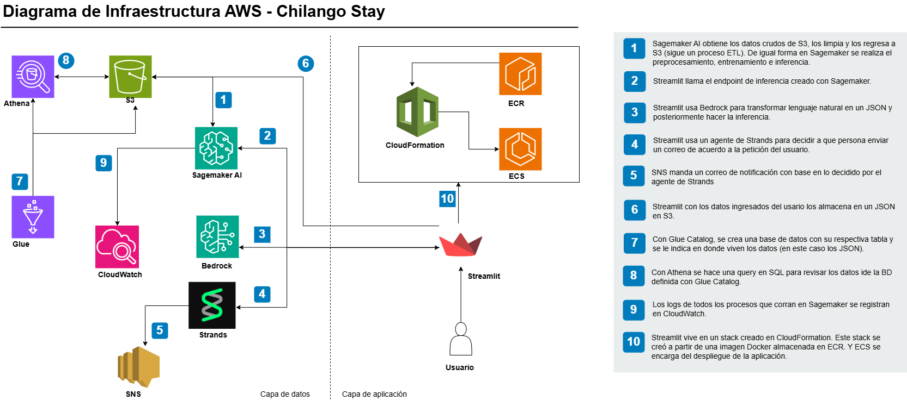

# Chilango Stay

| Elemento | Detalle |
|----------|---------|
| **Equipo** | Diana Arroyo / Luis Cuadros |
| **URL App** | http://chilango-alb-pv6osdyrpasg-281902611.us-east-1.elb.amazonaws.com/ |

> Estimación inteligente de precios de alojamiento en Ciudad de México mediante machine learning, LLMs y agentes de IA, desplegado como aplicación en AWS.

---

## Tabla de contenido

- [¿Qué es?](#qué-es)
- [¿Para quién?](#para-quién)
- [Experiencia de usuario](#experiencia-de-usuario)
- [Arquitectura y tecnologías](#arquitectura-y-tecnologías)
- [Datos](#datos)
- [Inteligencia aplicada](#inteligencia-aplicada)
- [Estructura del repositorio](#estructura-del-repositorio)
- [Definición del producto](#descripción-del-producto)
- [FAQ](#FAQ)


---

## ¿Qué es?

Chilango Stay - Estimador de Precios CDMX es una aplicación construida sobre AWS que permite a un anfitrión de Airbnb obtener una **estimación de precio por noche en MXN** para su propiedad en Ciudad de México. El usuario describe su alojamiento en lenguaje natural y el sistema se encarga del resto: extrae los atributos relevantes, valida la ubicación, aplica el modelo predictivo y devuelve el resultado en menos de 10 segundos.

---

## ¿Para quién?

El usuario final es el **anfitrión (host) de Airbnb en CDMX**: propietarios o arrendatarios que rentan inmuebles a través de plataformas de alojamiento a corto plazo. Desde quien renta un cuarto extra hasta pequeños inversores con varios inmuebles. No se requieren conocimientos de estadística ni de mercado inmobiliario.

**El problema que resuelve:** fijar el precio correcto de un alojamiento sin una referencia objetiva basada en datos es difícil. Un precio alto reduce la ocupación; uno bajo deja dinero sobre la mesa. La mayoría de los anfitriones fijan precios por intuición o copiando a competidores cercanos, lo que resulta en ingresos subóptimos.

---

## Experiencia de usuario

```
1. Abre la app de Streamlit desde cualquier navegador.
2. Escribe la descripción de tu propiedad en lenguaje natural, o bien, selecciona manualmente las características.
3. El sistema extrae atributos, valida ubicación y llama al modelo.
4. Ves el precio estimado + tabla de atributos detectados en < 10 seg.
5. Puedes realizar un análisis de sensibilidad para extraer información más relevante de tu propiedad.
5. Ajusta la descripción y vuelve a consultar cuantas veces quieras.
```

**Ejemplo de input:**
> *"Tengo un departamento en la Condesa, 2 recámaras, 1 baño, balcón y estacionamiento, para 4 personas."*

**Output:**
| Campo | Valor detectado |
|---|---|
| Alcaldía | Cuauhtémoc |
| Tipo | Entire home/apt |
| Ocupantes | 4 |
| Habitaciones | 2 |
| Camas | 2 |
| Baños | 1.0 |
| Estacionamiento | ✓ Sí |
| Patio/Balcón | ✓ Sí |
| **Precio estimado** | **$X,XXX MXN / noche** |

---

## Arquitectura y tecnologías


---

## Datos

- **Fuente:** dataset público de Inside Airbnb para Ciudad de México
- **Registros:** 22,274 listados activos
- **Formato:** Parquet almacenado en S3
- **Alcaldías cubiertas:** 16 alcaldías de CDMX

### Variables predictoras

| Variable | Descripción |
|---|---|
| `neighbourhood_cleansed` | Alcaldía (16 categorías) |
| `latitude` / `longitude` | Coordenadas geográficas |
| `room_type` | Entire home/apt · Private room |
| `accommodates` | Número máximo de huéspedes |
| `bathrooms` | Número de baños |
| `bedrooms` | Número de habitaciones |
| `beds` | Número de camas |
| `parking` | Estacionamiento (0/1) |
| `patio_balcon` | Patio o balcón (0/1) |

---

## Inteligencia aplicada

### 1. XGBoost — Modelo de regresión
- Target: `log1p(price)` para reducir sesgo por outliers
- Hiperparámetros: optimizados con `RandomizedSearchCV` (50 iteraciones × 5 folds CV)
- RMSE: train -> 0.30 validación -> 0.42
- R2: validación -> 0.66

### 2. Feature engineering
- **Target encoding con smoothing bayesiano** para `neighbourhood_cleansed`: alcaldías con pocas muestras reciben un encoding mezclado con la mediana global (`smoothing=10`), evitando overfitting
- **Oversampling** de alcaldías minoritarias (< 212 muestras): Xochimilco, La Magdalena Contreras, Tláhuac y Milpa Alta — aplicado solo al split de train para evitar data leakage
- **Geo-clusters**: cuadrícula 5×5 sobre CDMX con quantile cut de lat/lon — captura variación de precio dentro de la misma alcaldía
- **Features derivadas**: `guests_per_room`, `beds_per_guest`, `amenity_score`, `capacity_bath`, `dist_centro` (distancia al Ángel de la Independencia), `is_large`, `is_private_room`

### 3. LLM — Extracción de entidades (Bedrock / Claude)
Una sola llamada a Bedrock extrae en JSON todos los atributos del alojamiento desde el texto libre del usuario, incluyendo `is_valid_listing` para detectar solicitudes sin relación con alojamientos.

### 4. Geocodificación semántica con LLM
Si el usuario menciona una dirección o colonia no reconocida por el diccionario de alcaldías, se hace una segunda llamada a Bedrock para que Claude identifique alcaldía y coordenadas. El resultado se guarda en **caché persistente en S3** con búsqueda difusa (Jaccard + coverage, umbral 0.6), evitando llamadas redundantes para variaciones de la misma dirección.

### 5. Agente con AWS Strands
Orquesta el flujo completo de razonamiento: extracción → validación de restricciones → feature engineering → inferencia → presentación del resultado.

### Restricciones implementadas
1. La ubicación debe ser CDMX — si no, muestra lista de alcaldías válidas
2. Defaults automáticos: 2 ocupantes, 2 recámaras, 2 camas, 1 baño, sin amenidades
3. `beds = bedrooms` si no se especifican camas
4. Geocodificación automática para direcciones y colonias
5. Solicitudes sin relación con alojamientos → mensaje de error

---

## Estructura del repositorio

```text
/
├── app
│   └── app.py            #código de la Streamlit
├── artifacts
│   └── random_search_results.json #mejores hiperparámetros de entrenamiento
├── data
│   ├── listings
│   │   └── listings.csv.gz    #dataset crudo
│   └── raw
│       └── airbnb_final.parquet #dataset limpio
├── docs
│   ├── chilangopng.png
│   ├── diagrama.png
│   └── logo.svg
├── infra
│   ├── Dockerfile #imagen de la app
│   ├── ecs-fargate-app.yaml  #infra de CLoudFormation
│   └── requirements.txt      #bibliotecas necesarias
├── model
│   └── model.tar.gz          #mejor modelo entrenado
├── src
│   ├── agent
│   │   ├── agente.py         #código de Strands
│   │   └── bedrock.py        #código para infe con lenguaje
│   ├── inference
│   │   └── inference.py #inferencia
│   ├── preprocessing
│   │   ├── download.py     #descarga y limpia
│   │   └── preprocessing.py #crea features
│   ├── train
│   │   └── traing.py       #entrenamiento
│   ├── config.py           #configuración global
│   ├── cw_logger.py        #logger de CloudWatch
│   └── orchestartor.ipynb #Orquestador
└── README.md
```

---

## Definición del producto

[Definición del producto](docs/Definicion.pdf)

---

## FAQ

[FAQ](docs/FAQ.pdf)

---
